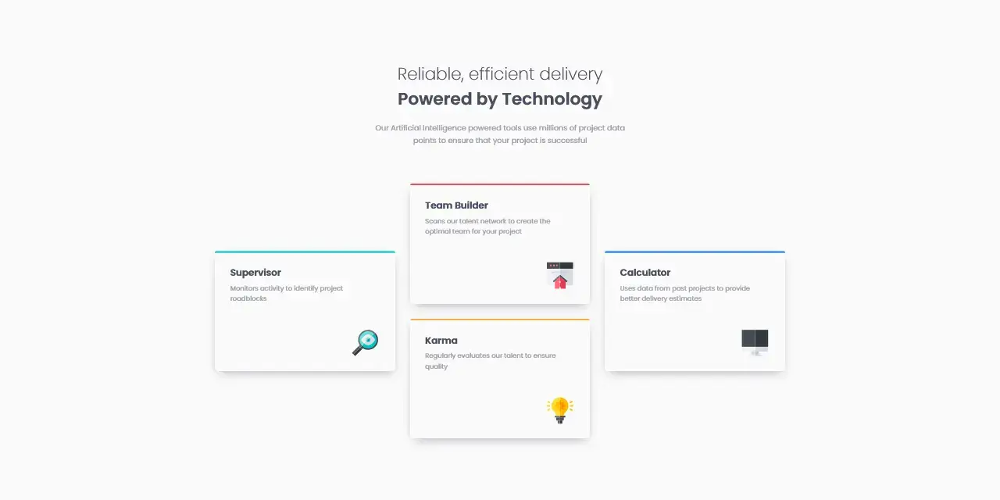

# Frontend Mentor - *Four card feature section* solution

This is my solution to the [Four card feature section](https://frontendmentor.io/challenges/four-card-feature-section-weK1eFYK) challenge on Frontend Mentor.

## Table of contents

- [Overview](#overview)
  - [Screenshot](#screenshot)
  - [Links](#links)
- [My process](#my-process)
  - [Tools](#tools)
  - [Features](#features)
- [Resources](#resources)

## Overview

### Screenshot

### Links

- Solution URL: <https://frontendmentor.io/solutions>
- Live Site URL: <https://erratic-enigma.github.io/four-card-feature>

## My process

### Tools

- [Vite](https://vitejs.dev)
- [SCSS](https://sass-lang.com)

### Features

- Semantic HTML5 markup
- [RCCSS (Reasonable System for CSS)](https://rstacruz.github.io/rscss)
- CSS custom properties
- Flexbox
- CSS Grid

## Resources

### Attributions

- **Fonts**
  - [Poppins](https://indiantypefoundry.com/fonts/poppins)